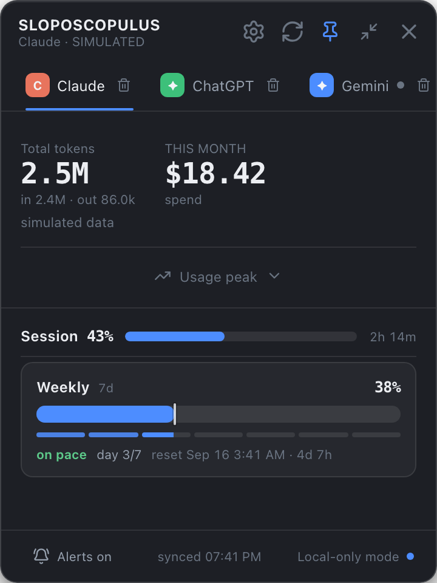

# Sloposcopulus

A floating macOS widget that shows how much you're spending and burning through on AI tools. Claude, ChatGPT, Gemini, GitHub Copilot, or anything custom you add.



## What it does

Sits on top of your other windows and tracks token usage, spend, and quota per agent. Works with fake data out of the box, add an API key in Settings and it switches to real numbers pulled straight from the provider.

Drag it anywhere, resize it, or shrink it down to a compact one-liner. Keys are stored in the macOS Keychain, not some plaintext file.

## Get it

Download the latest `.dmg` from [Releases](https://github.com/moen0/Sloposcopulus/releases), drag it into Applications. It's unsigned for now, so right-click the app the first time and hit Open to get past Gatekeeper.

## Build it yourself

```sh
npm install
npm run tauri dev      # dev build with hot reload
npm run tauri build    # produces the .app and .dmg
```

Needs Rust, Node 18+, and Xcode command line tools.

## License

MIT
